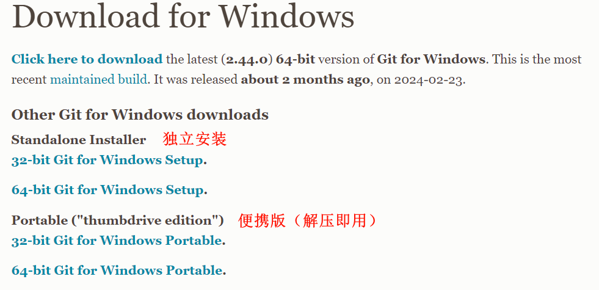
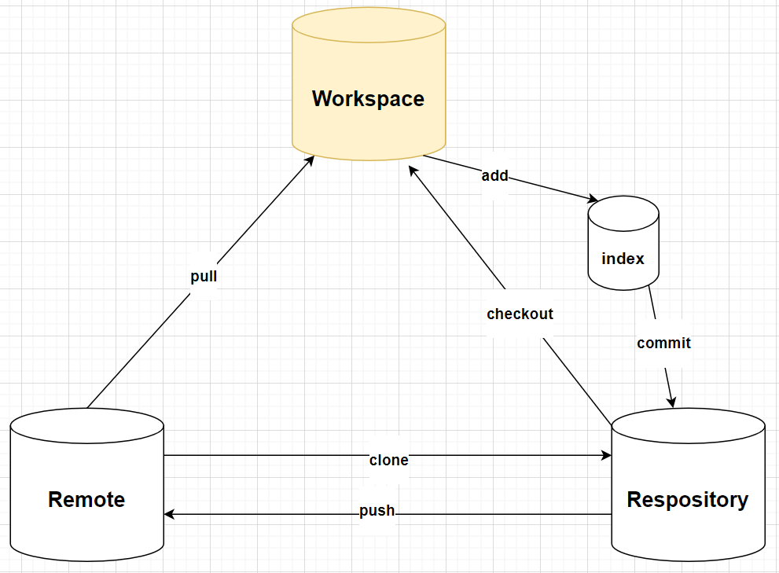

# Git安装

Git代码管理系统

## 下载Git

下载地址：<https://git-scm.com/download/win>

Windows：点击`64-bit Git for Windows Setup`即可下载安装程序。

不同用户根据需求安装不同版本

## 安装Git

默认安装即可

## 运行机制

1. workspace：工作区，就是直接进行编写文件所在的文件夹（除了`.git`文件夹）
2. Respository：本地仓库，位于 `.git/objects`中，存储了各个版本的文件
3. index：缓存区，位于`.git/index`中，你添加未提交的文件暂存在这里
4. Remote：远端仓库，位于Github或Gitee中你创建的仓库
