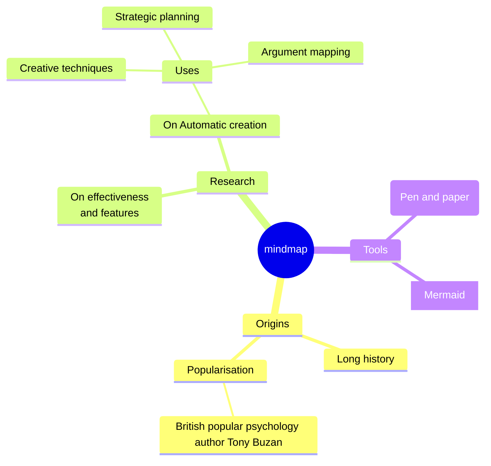
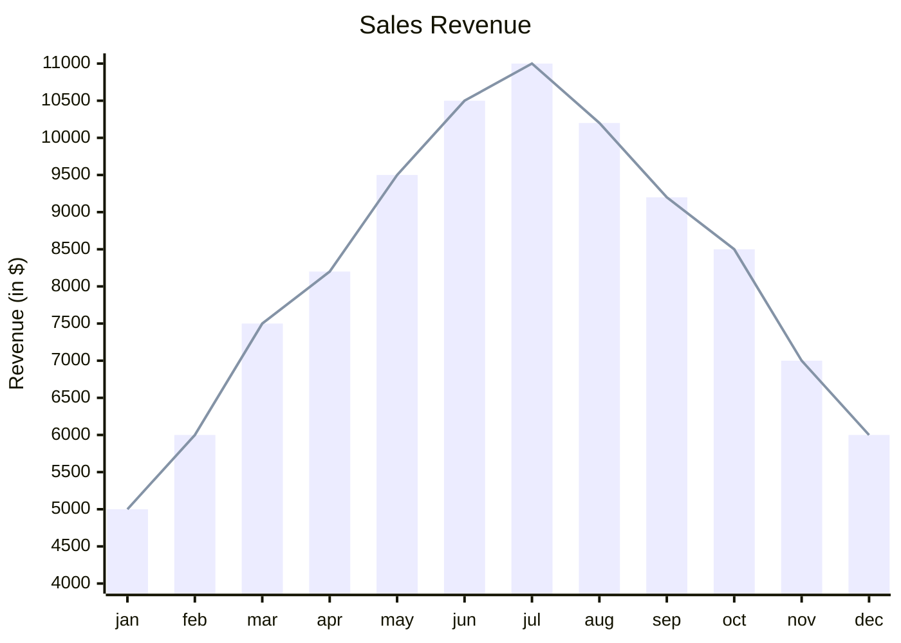
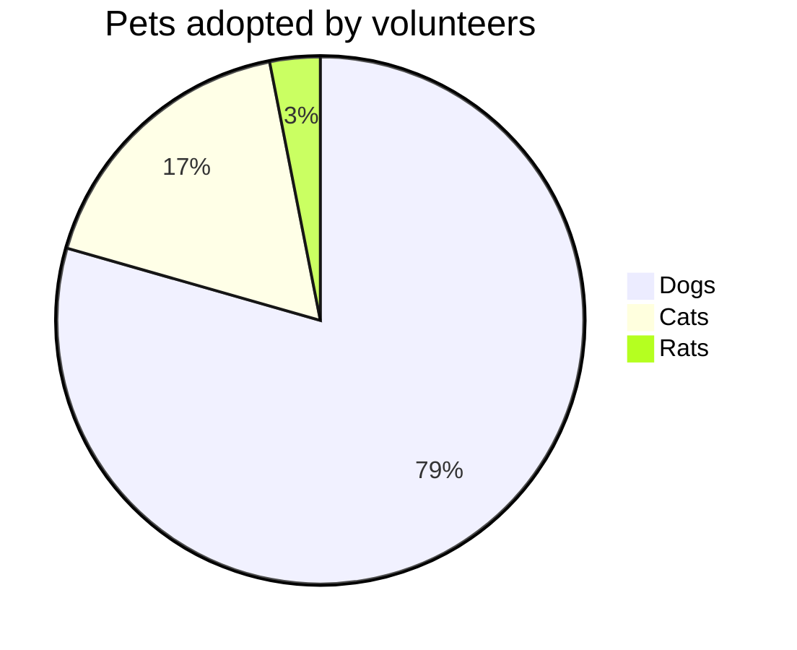
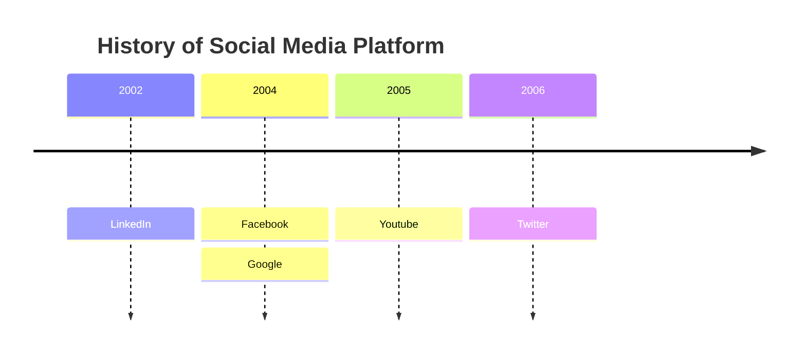
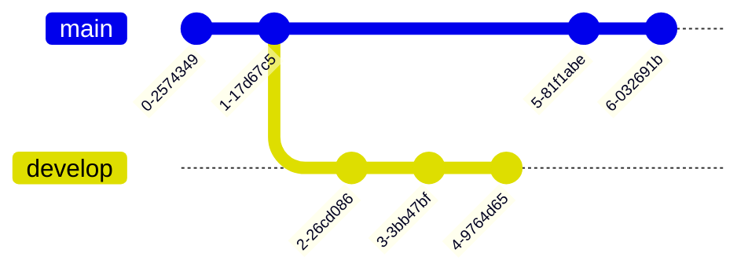

# Mermaid

## 作者：ShuHang2

## [返回主页](../README.md)

[mermaid官方文档](https://mermaid.nodejs.cn/intro/)

## 常用图标类型

使用方法：

1. 在支持Mermaid的Markdown的软件中，在代码块中输入maermaid代码，再将代码块类型改为mermaid
2. 也可以在官网查看本地、网页部署方法

### 流程图

### 思维导图

各种形状

1. 正方形 `id[ ]`
2. 椭圆形`id( )`
3. 圆形`id(( ))`
4. 砰`id)) ((`
5. 云`id) (`
6. 六边形`id{{ }}`

### XY图

### 饼图

## 时间线图

### GIT图

