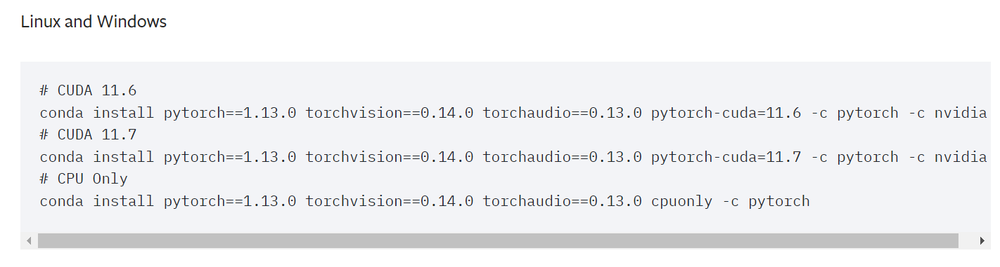

# pytorch-GPU版本和torchtext 安装
### 作者：ShuHang2

## **想使用 GPU 训练一定要安装的 torchtext 要与安装的 pytorch 版本对应**

## 步骤

1. 新建一个 conda 环境，最好新建不会乱
2. 先查看你的显卡版本
   1. Win+r
   2. 输入 cmd
   3. 输入 nvidia-smi
   4. 查看右上角  CUDA Version: 11.7（我的）
3. 然后选择你要安装的 torchtext 版本
4. 选择好你要下载的版本比如说 torchtext=0.14.0 ，根据上面的表可以看出我们需要下载 torch=1.13.0 版本的 pytorch ，先不要下载 torchtext=0.14.0
5. 进入 pytorch 官网，进入历史版本 [PREVIOUS VERSIONS OF PYTORCH](https://pytorch.org/get-started/previous-versions/)
6. 下载 torch=1.13.0 的 gpu 版本 
7. 选择自己 cuda 的版本号，CUDA Version: 11.7
   1. 进入你创建的 conda 虚拟环境
   2. 输入： `conda install pytorch==1.13.0 torchvision==0.14.0 torchaudio==0.13.0 pytorch-cuda=11.7 -c pytorch -c nvidia`
   3. 等待下载完成
8. 下载 torchtext 安装
   1. 进入 [torchtext](https://pypi.org/project/torchtext/0.15.1/#history)
   2. 选择你要下载的版本 torchtext=0.14.0（我的）
   3. 在右上角复制到你的虚拟环境中，回车。
   4. 等待下载完成，即可
